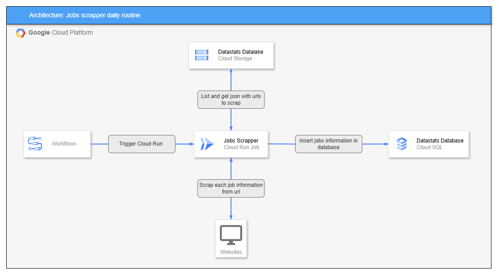

# 🚀 Datastats GCP Jobs Scraper

This repository is a part of the **Datastats** x **GCP** project.

## ✨ Datastats x GCP Purpose

The goal of this project is to collect daily job offers informations in data-related professions, in order to monitor market trends and the most in-demand technologies.

## 🤔 What is the Jobs Scraper?

This repository contains a Cloud Run Job that retrieves job offer URLs from various sources, scrapes detailed information for each offer, and stores the results in a PostgreSQL database on GCP. The workflow is designed to be automated, scalable, and cloud-native.

- The scraper processes a list of job URLs (provided via GCS bucket), extracts relevant job information, and inserts it into the database.
- Errors and problematic URLs are logged and stored for later analysis.
- The architecture is modular, allowing for easy extension and parallelization.

## 👷🏻‍♀️ Architecture

- A Cloud Scheduler triggers a Workflow, which orchestrates the scraping process.
- The workflow downloads job URLs from a GCS bucket, then launches the scraping job in Cloud Run.
- Scraped job data is inserted into a PostgreSQL database (Cloud SQL).
- Errors and statistics are logged for monitoring and debugging.



## 📁 Repository tree

```shell
datastats-gcp-jobs-scraper/
├── assets/
│   └── jobs_scraper_architecture.png
├── src/
│   ├── main.py
│   └── utils/
│       ├── __init__.py
│       ├── config_loader.py
│       ├── datastats_utils.py
│       ├── gcp_utils.py
│       ├── jobs_scraper.py
│       └── pg_utils.py
├── local/
│   └── test.py
├── .gitignore
├── Dockerfile
├── pyproject.toml
├── README.md
└── uv.lock
```

## 💡 What's next?

Planned improvements for this repository:
- Add tests
- Add a detailed architecture diagram in `assets/`
- Improve error handling and monitoring
- Add more job sources and scraping strategies